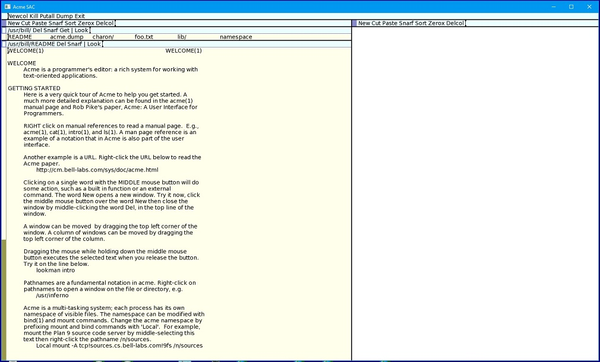

# vsc-acme 

plan9/acme theme

The plan9 system was created at Bell Labs by many of the same people who created Unix. It's a distributed operating system that
was first (non-publically) released in 1992(1). The 4th Edition was released in 2002 under an open-source license and the final
release came in 2015. Several off-shoots have been created, bringing more of the familiar 'unix' software to the system. There
is even a port to Raspberry Pi.

## The acme environment


The acme software, often referred to as an editor, is better characterized as a 'work environment'. You can edit documents and
code, then open a terminal window to compile/run the code. The colors presented by this theme are the colors defined by acme,
most specifically:

```
enum
{
    DPaleyellow    = 0xFFFFAAFF,  /* RGB(255, 255, 170) */
    DDarkyellow    = 0xEEEE9EFF,  /* RGB(238, 238, 158) */
    Dpalebluegreen = 0xAAFFFFFF,  /* RGB(170, 255, 255) */
    DPalegreen     = 0xAAFFAAFF,  /* RGB(170, 255, 170) */
    DYellowgreen   = 0x99994CFF,  /* RGB(153, 153, 076) */
    DPurpleblue    = 0x8888CCFF,  /* RGB(136, 136, 204) */
};
```

## Links

Here are additional links to plan9 and acme information.

[Plan9 from Bell Labs](https://en.wikipedia.org/wiki/Plan_9_from_Bell_Labs) - https://en.wikipedia.org/wiki/Plan_9_from_Bell_Labs

[Plan9 documentation](http://doc.cat-v.org/plan_9/4th_edition/papers/9)

[Plan9 downloads](https://9p.io/plan9/) - https://9p.io/plan9/


<hr>
Footnotes -

(1) Coincidentally, I recall receiving the first Public Beta of Windows NT 3.1 in June of 1992.
